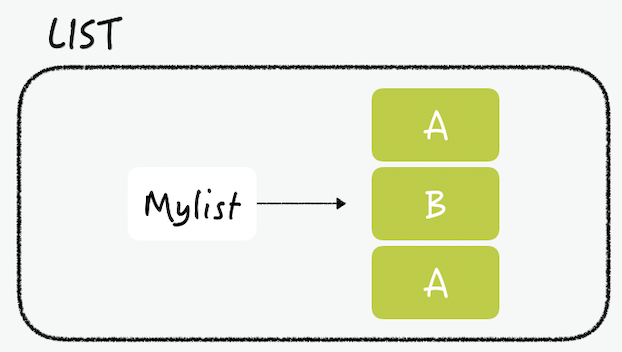
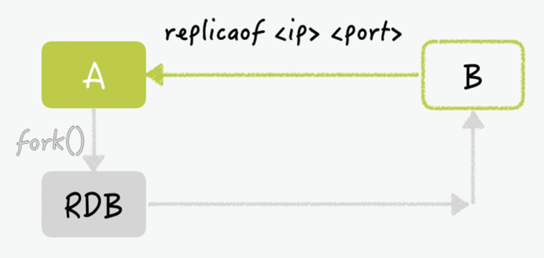

# 데이터베이스
* 컴퓨터 시스템에 저장되는, 구조화된 정보 혹은 데이터의 집합

## DBMS(Database Management System)
데이터베이스에서 데이터를 정의(define), 저장(store), 검색 및 인출(retrieve), 관리 하기 위해 사용되는 소프트웨어

### DBMS 의 종류
* SQL
    * 관계형 데이터베이스 (RDB)
    * SQL 필수
* NOSQL
    * 비관계형 데이터베이스
    * Not Only SQL

RDB
* 데이터가 테이블(column, row) 형태로 저장
* 테이블 사이의 관계(relationship)로 구조 형성
* SQL 이용

NoSQL
* Document 타입
    * 주로 json 타입으로 데이터 표시
* Graph 타입
    * 이상 탐지에 유리 node - edge 구조로 데이터 엮음
* Key - Value 형태
* Wide - Column
    * 구조적으로 테이블 형태를 띄는데 Column 의 수가 변할 수 있음 row 마다

### redis?
레디스는 In-Memory 데이터베이스. 모든데이터를 메모리에 저장하고 조회

why? 메모리 접근이 디스크 접근보다 빠르기 때문

redis 는 다양한 자료구조를 지원한다. 다양한 자료구조를 key-value 형태로 저장하게 된다.

예를 들어 실시간 랭킹 서버를 구현할 때 관계형 DBMS를 이용한다면 DB에 데이터를 저장하고 저장된 SCORE 값으로
정렬하여 다시 읽어오는 과정이 필요할 것이다.

추가적으로 트랜잭션의 문제도 해결해 줄 수 있다. 싱글 스레드로 동작하기 때문에 atomic하다! 따라서 race condition
을 피할 수 있다.

### 레디스의 자료구조
* #### string
레디스의 string은 키와 연결 할 수있는 가장 간단한 유형의 값이다. 레디스의 키가 문자열이므로 이구조는
문자열을 다른 문자열에 매핑하는 형태라고 볼 수 있다.

* 문자 저장 연산 set
> $ set hello world 
> OK 
> $ get hello 
> "world"

* 키를 새 값으로 변경하고 이전 값을 반환하는 커맨드
> $ incr mycounter (incr : mycounter 에 0을 넣고 +1 한 값 반환) 
> $ getset mycounter "0"  
> "1"  
> $ get mycounter  
> "0"

* 키가 이미 존재하거나, 존재하지 않을 때만 데이터를 저장하게 하는 옵션
> $ set mykey newval nx
> $ set mykey newval xx

string 타입에는 모든 종류의 문자열(이진 데이터 포함) 을 저장할 수 있다.

* #### list

레디스의 list는 일반적인 linked list 의 특징을 가지고 있다. 따라서 list 내에 수백만 개의 아이템이 있더라도
head와 tail에 값을 추가할 때 동일한 시간이 소요 된다.

list 의 대표적인 사용 사례는 Pub-Sub 패턴에 있다. (생산 구독) 프로세스간의 통신 방법에서 생산자가 아이템을
만들어서 list에 넣으면 소비자가 꺼내와서 액션을 수행하는 식으로 동

기존 polling 방식으로 데이터를 받아왔던 기능을 brpop을 사용하여 polling 프로세스를 줄일 수도 있다.

* #### hash

hash는 field-value 쌍을 사용한 일반적인 해시. key에 대한 filed의 갯수에 제한이 없으므로 여러 방법으로 사용이
가능하다.

일반적으로 RDB 테이블을 다음과 같이 분리한다.

users 테이블의 pk 값이 redis에서 key 값으로 대칭 시킬 수 있기 때문에 위와 같은 구조로 저장하게 된다.

* #### Set
set은 정렬되지 않은 문자열의 모음이다. 교집합, 합집합, 차집합 연산을 레디스에서 수행 할 수 있기 때문에
객체 간의 관계를 표현할 때 좋다.

예를 들자면 게시글에서 여러개의 카테고리를 가지고 있고 게시글간의 공통 카테고리를 뽑아내고 싶다고 한다면 간단하게
뽑아낼 수 있는 것이다.

* #### 그외
    * bit/bitmap: 일반적인 비트 연산이 가능
    * hyperloglogs: 집합의 카디널리티(원소의 갯수 RDB에서는 row수)를 추정하기 위한 데이터 구조
    * Stream : 로그를 처리하기 위해 최적화된 데이터 타입
    * Geospatial indexes : 위경도로 거리 계산

#### 연산자 자료 정리
https://inpa.tistory.com/entry/REDIS-%F0%9F%93%9A-%EB%8D%B0%EC%9D%B4%ED%84%B0-%ED%83%80%EC%9E%85Collection-%EC%A2%85%EB%A5%98-%EC%A0%95%EB%A6%AC?category=918728

#### Redis Key 의 설정
주로 object-type:id 의 형태를 권장 (domain:id)형식으로 추천 또한 '.', '-', ':' 등의 부호를 사용해서 관계
를 표현 하면 더 좋다.

#### Expire 기능
그러면 레디스 사용해서 저렇게 많은 기능을 다 사용하면 메인 메모리 터지는 거 아닌가? 
더 이상 메모리에 데이터를 저장할 수 없는 경우 레디스에서는 가장 먼저 들어온 데이터를 삭제하거나, 가장 최근에
사용되지 않은 데이터를 삭제하거나, 더이상 데이터입력 못한다.

가장 좋은 방법은 삭제되는 데이터를 레디스가 선택하도록 맡기지 않고, 직접 설정하는 것 직접 설정해 줌으로서, 해당 데이터
가 삭제 되는 타이밍을 제어 할 수 있게 된다.

동일한 키가 다시 들어오면 이 timeout은 재설정 되기때문에 자주 사용되는 데이터는 남아있고
아닌 데이터는 삭제된다.

## 레디스의 실제 사용

### 캐시로서의 레디스
대부분의 서비스에서 레디스를 단순 캐시용도로 사용 
이때 레디스를 어떻게 배치하는지가 시스템의 성능에 큰 영향을 미칠 수 있다.

#### * Look Aside (Lazy Loading)
캐시를 옆에 두고 필요할 때만 데이터를 캐시에 로드하는 캐싱 전략 
캐시는 데이터베이스와 어플리케이션 사이에 위치하여 단순 key-value 형태를 저장 

1. 어플리케이션에서 데이터를 가져올 때 레디스에 항상 먼저 요청
2. 데이터가 캐시에 있을 때는 레디스에서 데이터 반환 (Cache Hit)
3. 캐시에 데이터가 없을 경우 어플리케이션에서 RDB로 데이터 요청 후에 해당 데이터값
레디스에 적제 (Cache Miss)

* 장점
    * 실제로 사용되는 데이터만 캐시 할 수있다.
    * 레디스의 장애가 어플리케이션에 치명적이지 않다
* 단점
    * 캐시에 없는 데이터를 쿼리할 때 더 오랜 시간이 걸린다.
    * 캐시가 최신 데이터를 가지고 있다는 것을 보장받지 못한다. 
  캐시에 해당 key 값이 존재하지 않을 때만 캐시에 대한 업데이트가 일어나기 때문

#### Write-Through

데이터의 변화는 데이터를 update, insert 할 때만 일어난다.

Write-Through 구조는 데이터베이스에 데이터를 작성 할 때마다 캐시에 데이터를 추가
업데이트한다.

* 장점
    * 캐시의 데이터는 항상 최신 상태로 유지

* 단점
    * 데이터 입력 시 두번의 과정을 거쳐야 하므로 지연 시간이 증가
    * 사용되지 않는 데이터 일단 캐시에 저장하므로 리소스 낭비
        * 해결하기 위해 데이터 입력 시 TTL을 꼭 사용하여 사용되지 않는 데이터 삭제

TTL : 데이터의 유효 기간을 나타내기 위한 방법

### 사전 지식

* HA?(고가용성, 고가용도)

가용성은 시스템 고장 발생 시 얼마나 빠른 시간내에 치료가 되어 다시 정상적으로 서비스
할 수 있는 상태인지를 분석하는 척도

* 리플리케이션?

    * 리플리케이션 이란 여러 개의 DB를 권한에 따라 수직적인 구조(Master-Slave)로 구축하는
방식이다. 리플리케이션에서 Master Node는 쓰기 작업만을 처리하며 Slave Node는
읽기 작업 만을 처리한다. 리플리케이션은 비동기 방식으로 노드들 간의 데이터를 동기화
한다.

* 클러스터링?

    * 클러스터링 이란 여러개의 DB를 수평적인 구조로 구축하는 방식. 클러스터링은 분산 환경을
구성하여 Single point of failure와 같은 문제를 해결 할 수 있는 Fail Over 
시스템을 구축하기 위해서 사용된다. 클러스터링은 동기 방식으로 노드들 간의 데이터를 동기화

https://mangkyu.tistory.com/97

### 레디스의 HA(High Availability)

레디스는 Master - Replica 형태의 복제를 제공. 복제 연결이 되어있는 동안 마스터
노드의 데이터는 실시간으로 레플리카 노드에 복사된다. 서비스를 제공하던 마스터 노드가
다운되더라도 레플리카 노드에 어플리케이션을 재연결해주면 서비스를 계속 할 수있다.

복제 그룹에서 항상 한개의 마스터 노드만 존재. 리플리카가 2개의 마스터를 가지는 것은 불가능
하다.

how to?
> 마스터 노드의 IP가 127.0.0.1, 포트가 6001일 경우
> $ replicaof 127.0.0.1 6001

#### 복제 후 데이터 동기화 과정
1. 복제 명령어 실행 (replicaof ...)
2. replicaof 명령어를 받은 마스터 노드 A는 자식프로세스를 만들어 백그라운드로 덤프
파일을 만들고, 네트워크를 통해 레플리카 노드 B로 보낸다.
3. 파일을 받은 노드 B는 데이터를 메모리에 로드

4. application 에서 cud 작업을 하여 데이터에 변화가 생기게 되면 마스터는
어플리케이션에 ACK를 보낸다.
5. 데이터 복제는 비동기 방식으로 이루어지게 된다. 따라서 데이터가 리플리카 노드까지 전달
되지 않고 유실될 가능성이 존재한다. (but 전달 속도가 매우 빨라 유실 거의 발생 X)

### 장애의 위험성
레디스 프로세스의 다운 => 메모리 내에 저장됐던 데이터는 유실

* replica node 의 다운 -> 그저 read only 하나가 손실이 난 것이므로 크게 상관 X
* master node 의 다운 -> rdb 로 갑자기 트래픽 요청 증가로 큰 장애 날 수 있다.

따라서 master 가 죽더라도 장애가 영향이 미치지 않도록 하는 방법을 찾아야한다.

### sentinel 구성하기
위에서 살펴본 장애 상황을 피할 수 있도록 도와주는 것이 Sentinel이다.

Sentinel 을 홀수로 구성해야 FailOver 처리가 가능하다.

페일 오버의 처리과정은 다음과 같다

1. 센티널은 Redis 서버에 대한 상태를 감시한다.
2. master 오류 발생 하여 프로세스가 종료되었다.
3. 센티널 중 하나가 master에 응답이 없다고 나머지 에게 알린다.
   * 만약 과반수 이하라면 master의 상태를 정상으로 판단
   * 만일 과반수 이상이라면 slave를 master로 변경한다.
